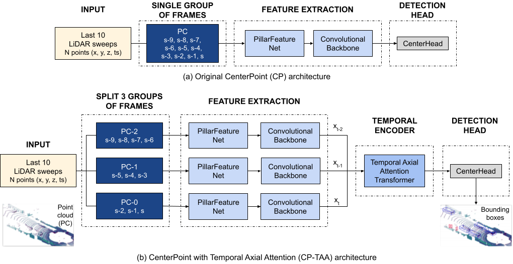

## TEMPORAL AXIAL ATTENTION FOR LIDAR-BASED 3D OBJECT DETECTION IN AUTONOMOUS DRIVING

This project is forked from the MMDetection 3D repository https://github.com/open-mmlab/mmdetection3d.
For installation and dataset preparation please follow the instructions on [this page](README_mmdet3d.md).

## Important requirements
This project has been developed with version v0.17.1. of MMDetection3D.

The following versions of the MMCV libraries are required:
- Python 3.6+ (Tested with 3.8 and 3.9)
- PyTorch 1.9.0 - CUDA 10.2 
- [MMCV](https://github.com/open-mmlab/mmcv): mmcv>=1.3.8, <=1.4.0 
```bash
## PyTorch 1.9.0 - CUDA 10.2
pip install mmcv-full==1.4.0 -f https://download.openmmlab.com/mmcv/dist/cu102/torch1.9.0/index.html
```
- [MMDetection](https://github.com/open-mmlab/mmdetection): mmdet>=2.14.0, <=3.0.0     `pip install mmdet`
- [MMSegmentation](https://github.com/open-mmlab/mmsegmentation): mmseg>=0.14.1, <=1.0.0     `pip install mmsegmentation`
- MMDetection3D: `pip install -v -e .`

## Introduction
This work has been published in ICIP 2022, and the paper can be found [here]((http://www-video.eecs.berkeley.edu/papers/cgmanuel/ICIP_2022_Manuel__Copy_.pdf)).

We propose a modified CenterPoint architecture, with a novel temporal encoder  that uses temporal
axial attention to exploit the sequential nature of autonomous driving data for 3D object detection. The last ten LiDAR sweeps are split into three groups of frames, and the axial attention transformer block captures both spatial and temporal dependencies among the features extracted from each group.
We used the nuScenes dataset, available at www.nuScenes.org, and we plan to extend this work with other datasets such as Waymo.



The main modifications in the MMDetection3D repository are the following:

- **Temporal encoders**: The designed [axial attention transformer](mmdet3d/models/temporal_encoders/axial_attention_transformer.py) and [ConvLSTM](mmdet3d/models/temporal_encoders/convlstm.py) are registered as modules, so they can be easily build from the config files.
- **Modified detector model with temporal encoder**: We have modified the [centerpoint.py](mmdet3d/models/detectors/centerpoint.py) and [mvx_two_stage.py](mmdet3d/models/detectors/mvx_two_stage.py) to support the use of the temporal encoder, named pts_temporal_encoder.
- **Config files**: Prepared several configurations with different pillar sizes using the CP-TAA architecture in the [centerpoint_temporal](configs/centerpoint_temporal) folder.
- **Scripts**: Prepared a [script file](scripts/nuscenes_scripts.sh) with all necessary scripts to run train, test, evaluation, visualization, etc.


## Example usage

### Config file
This example [config file](configs/centerpoint_temporal/centerpoint_02pillar_nd_transformer_second_secfpn_4x8_cyclic_20e_nus.py) can be used for the CP-TAA architecure with pillar size 0.2. 

The main change is to add the pts_temporal_encoder, with adequate parameters, in the model config dict:

```python
model = dict(
  pts_temporal_encoder=dict(type='AxialAttentionTransformer',
            dim=384,
            num_dimensions=3,
            depth=1,
            heads=8,
            dim_index=2,
            axial_pos_emb_shape=(3, 128, 128),
            fc_layer_attn=False))
```
### Training
To train the model using 2 GPUs:

```bash
RESULTS_DIR=results/nuscenes/centerpoint/pillar02
CONFIG_FILE=configs/centerpoint_temporal/centerpoint_02pillar_nd_transformer_second_secfpn_4x8_cyclic_20e_nus.py
./tools/dist_train.sh ${CONFIG_FILE} 2 --work-dir=${RESULTS_DIR}
```
### Test

To test the model using 2 GPUs:

```bash
RESULTS_DIR=results/nuscenes/centerpoint/pillar02
CONFIG_FILE=configs/centerpoint_temporal/centerpoint_02pillar_nd_transformer_second_secfpn_4x8_cyclic_20e_nus.py
CHECKPOINT=${RESULTS_DIR}/latest.pth

./tools/dist_test.sh ${CONFIG_FILE} \
${CHECKPOINT} 2 \
--out ${RESULTS_DIR}/result.pkl \
--eval mAP 
```


## Citation

If you find this project useful in your research, please consider cite:

```latex
@inproceedings{cp-taa,
    title={Temporal axial attention for {LiDAR}-based {3D} object detection in autonomous driving},
    author={Manuel Carranza-García, José C. Riquelme, Avideh Zakhor},
    booktitle = {29th IEEE International Conference on Image Processing (IEEE ICIP)},
    year={2022}
}
```


